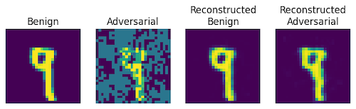
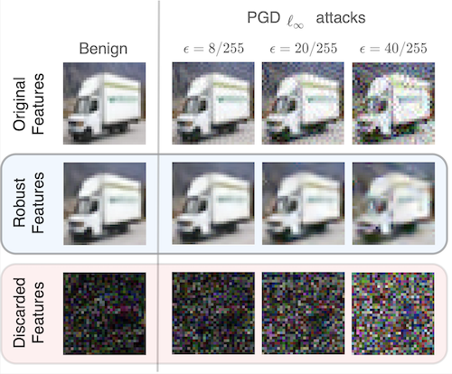

# Sabre: Cutting through Adversarial Noise with Adaptive Spectral Filtering and Input Reconstruction

_PyTorch Implementation of the adversarial defense framework "[Sabre](https://alec-diallo.github.io/publications/sabre)"._

## Getting Started
Setting up a local environment to run and use the Sabre framework.

### Cloning the repository
Clone the Sabre repository to your local machine by running:

```shell
git clone https://github.com/Mobile-Intelligence-Lab/SABRE.git [LOCAL_DIRECTORY_PATH]
```
Replace `[LOCAL_DIRECTORY_PATH]` with your desired directory path or leave it blank to clone in the current directory.

### Installing dependencies
Install the required Python packages using:

```shell
pip install -r requirements.txt
```

## Directory Structure
The repository is organized as follows:
```
Sabre
├── artifacts             - Output directory for experiment artifacts.
│   ├── attachments        - Directory for any attachments (e.g., figures, graphs).
│   ├── logs               - Experiment log files.
│   └── saved_models       - Directory for storing trained model weights.
├── core                - Implementation of core functionalities.
│   ├── attacks            - Methods for generating adversarial attacks.
│   │   ├── fgsm.py           - Fast Gradient Sign Method attack.
│   │   ├── pgd.py            - Projected Gradient Descent attack.
│   │   └── ... 
│   ├── defenses           - Defense mechanisms.
│   │   └── sabre.py          - Core implementation of the Sabre defense framework.
├── datasets            - Scripts for loading and preprocessing datasets.
│   ├── cifar10.py         - Handles the CIFAR-10 dataset.
│   ├── mnist.py           - Handles the MNIST dataset.
│   └── ...
├── experiments         - Experiment scripts and configurations.
│   └── images             - Image-based experiments
│   │   ├── cifar10.py        - Experiments on the CIFAR-10 dataset.
│   │   ├── mnist.py          - Experiments on the MNIST dataset.
│   │   └── ...
│   ├── setup.py           - Experiment setup and execution.
│   └── utils.py           - Utility functions for experiments.
├── models              - Model definitions.
│   ├── cifar10.py         - CIFAR-10 classification model.
│   ├── mnist.py           - MNIST classification model.
│   ├── denoise.py         - Denoising model implementation.
│   └── helpers.py         - Helper functions for model management.
├── notebooks           - Jupyter notebooks for demonstrations.
│   ├── cifar10.py         - CIFAR-10 notebook.
│   ├── mnist.py           - MNIST notebook.
│   └── ...
├── utils               - General utility functions and helpers.
│   └── log.py             - Logging utilities for monitoring and debugging.
├── requirements.txt    - Lists the Python package dependencies.
└── README.md           - Provides an overview and instructions for the repository.
```

## Experiments

### Robust classifiers
This section provides instructions for running experiments to evaluate the robustness of the models implemented in the framework. 
We focus on assessing performance against adversarial examples and viability across different datasets. 

#### MNIST
```shell
python3 experiments/images/mnist.py
```

#### CIFAR-10
```shell
python3 experiments/images/cifar10.py
```

#### Command-line arguments
The following arguments can be customized:

```
optional arguments:
  --model_name NAME     Name of the model
                        {'baseline', 'Adversarial Training', 'SABRE'}
                        (default: 'SABRE').
  --epsilon EPSILON
                        Perturbation limit for adversarial attacks
                        (defaults: 8/255 for CIFAR-10, 80/255 for MNIST).
  --batch_size BATCH_SIZE
                        Batch size (default: 32).
  --n_variants N_VARIANTS
                        Number of variants used in SABRE (default: 10).
  --normalize
                        Flag to enable the normalization of samples before classification.
  --disable_rand
                        Flag to disable the use of randomness in SABRE.
```

Usage examples are provided in the _notebook_ files:
> [notebooks/mnist.ipynb](./notebooks/mnist.ipynb)

and

> [notebooks/cifar10.ipynb](./notebooks/cifar10.ipynb)

#### Visualization of sabre's preprocessing results on MNIST



#### Visualization of sabre's preprocessing results on CIFAR-10



> Sabre extracts robust features from inputs proportionally to the amount of noise initially observed.

## Citation
<pre><code>@inproceedings{diallo2023sabre,
  title={Sabre: Cutting through Adversarial Noise with Adaptive Spectral Filtering and Input Reconstruction},
  author={Diallo, Alec and Patras, Paul},
  booktitle={45th IEEE Symposium on Security and Privacy},
  pages={1--18},
  year={2023},
  organization={IEEE}
}</code></pre>
